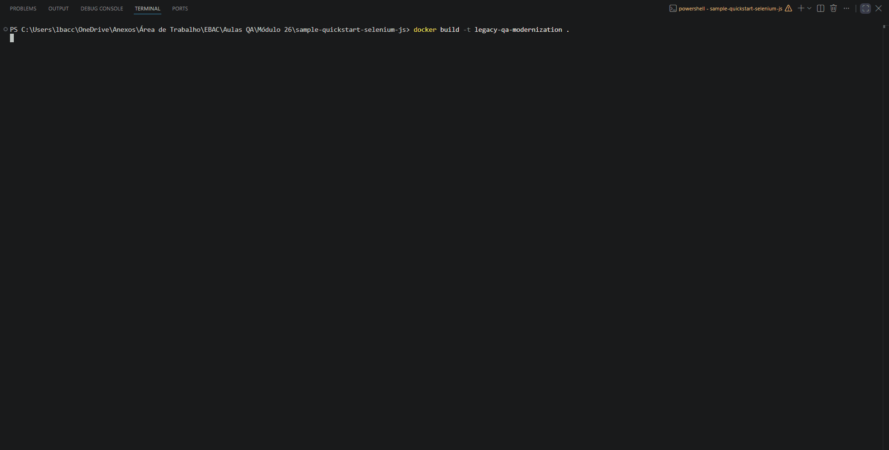

# Legacy QA Modernization Lab

🇧🇷: Projeto desenvolvido durante o curso de QA da EBAC e posteriormente modernizado para as versões atuais do ecossistema JavaScript.

🇺🇸: Project originally created during the EBAC QA course and later modernized to the current JavaScript ecosystem.

## 🎬 Demo

  

## About 

This project was originally built using an outdated automation stack from 2021/2022;

Instead of simply making the original code work, the project was modernized to current technologies while preserving its original purpose;

The migration included updating Node.js, WebdriverIO, Chrome execution inside Docker and removing deprecated dependencies.

## Legacy modernization

| Legacy Project | Mordern Project |
| -------------- | --------------- |
| Node Lateste (Node 26) | Node 20 LTS |
| WebdriverIO 7 | WebdriverIO 9 |
| ChromeDriver 96 | Automatic Driver Management |
| Manual ChromeDriver Service | Native WebdriverIO Driver |
| Dockerfile (2021) | Optimized Dockerfile |
| npm install | npm ci |
| Chrome patched using sed | Native Chrome Options | 

## Tech Stack

| Category | Technology |
|----------|------------|
| Language | JavaScript |
| Test Framework | WebdriverIO 9 |
| Test Runner | Mocha |
| Browser | Google Chrome |
| Container | Docker |
| CI/CD | GitHub Actions *(coming soon)* |
| Reports | Allure *(coming soon)* |

## Challenges solved

During the modernization process the following legacy issues were fixed:

- Dockerfile incompatible with modern Docker versions
- Deprecated Chrome installation process
- ChromeDriver version mismatch
- Migration from WebdriverIO 7 to WebdriverIO 9
- Node.js compatibility issues
- Docker optimization using layer cache
- Automatic browser driver management

## Roadmap

- ✅ Legacy project migration
- ✅ Docker modernization
- ✅ WebdriverIO 9 migration
- ✅ Automatic ChromeDriver management
- 🔄 Improve Page Object Model
- 🔄 Add Login tests
- 🔄 Add GitHub Actions
- 🔄 Add Jenkins Pipeline
- 🔄 Add Allure Reports
- 🔄 Cross-browser execution